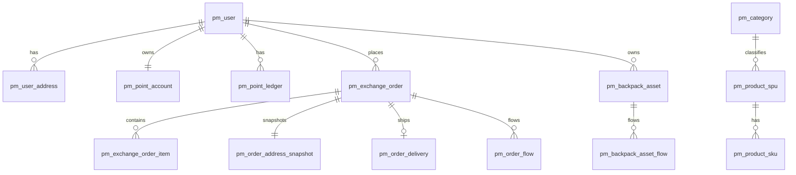

# 积分商城 MySQL 设计文档

- 文档版本：v1.0
- 编写日期：2026-03-16
- 数据库版本：MySQL 8.0.29
- 关联文档：`项目需求文档.md`、`项目技术架构文档.md`
- 设计目标：在覆盖当前需求的前提下，尽量通过“可配置 + 可扩展 + 可审计”设计，降低未来业务变化导致的结构变更概率。

---

## 1. 设计原则（面向“尽量不改表结构”）

1. **核心字段稳定 + 扩展字段承载变化**
   - 核心业务表均提供 `ext_json`（JSON）用于承载临时/扩展属性。
2. **状态/类型全部“码值化”**
   - 不使用 ENUM，统一使用 `*_code` + 字典表，避免新增类型时改表。
3. **交易快照化**
   - 订单、地址、商品关键信息快照入库，防止主数据变化影响历史单据。
4. **全链路可追溯**
   - 关键流程必须有流水表（积分流水、订单流转、背包资产流转、操作日志）。
5. **前瞻性支持扩展场景**
   - 预留 `tenant_id`、`app_id`、`channel_code`、`biz_ext_json`，支持未来多端、多渠道、多租户演进。
6. **高一致性场景优先**
   - 积分、库存、订单通过事务与幂等表保障一致性。

> 说明：任何数据库都无法“绝对永不改字段”，本方案已最大化考虑扩展空间，将未来大部分变化收敛在配置、字典、JSON 扩展和新增表层面。

---

## 2. 库与字符集规范

```sql
CREATE DATABASE IF NOT EXISTS points_mall
  DEFAULT CHARACTER SET utf8mb4
  COLLATE utf8mb4_0900_ai_ci;
```

- 存储引擎：InnoDB
- 时区：统一 `+08:00`（服务端写入）
- 时间字段：`datetime(3)`
- 主键：`bigint unsigned`（建议雪花 ID）
- 逻辑删除：`is_deleted tinyint(1)` + `deleted_at`

---

## 3. 全局字段规范（建议所有核心表统一）

| 字段 | 类型 | 说明 |
|---|---|---|
| id | bigint unsigned | 主键 |
| tenant_id | bigint unsigned | 租户ID（单租户默认 0） |
| app_id | varchar(64) | 应用标识（wxapp/admin/h5 等） |
| ext_json | json | 业务扩展字段 |
| version | int unsigned | 乐观锁版本号 |
| remark | varchar(500) | 备注 |
| created_by | bigint unsigned | 创建人 |
| created_at | datetime(3) | 创建时间 |
| updated_by | bigint unsigned | 更新人 |
| updated_at | datetime(3) | 更新时间 |
| is_deleted | tinyint(1) | 逻辑删除标记 |
| deleted_at | datetime(3) | 删除时间 |

---

## 4. 码值与配置体系（避免频繁加字段）

## 4.1 字典类型表 `pm_dict_type`

```sql
CREATE TABLE pm_dict_type (
  id                BIGINT UNSIGNED PRIMARY KEY,
  tenant_id         BIGINT UNSIGNED NOT NULL DEFAULT 0,
  dict_type_code    VARCHAR(64) NOT NULL,
  dict_type_name    VARCHAR(128) NOT NULL,
  status_code       VARCHAR(32) NOT NULL DEFAULT 'ENABLED',
  ext_json          JSON NULL,
  remark            VARCHAR(500) NULL,
  created_by        BIGINT UNSIGNED NOT NULL DEFAULT 0,
  created_at        DATETIME(3) NOT NULL DEFAULT CURRENT_TIMESTAMP(3),
  updated_by        BIGINT UNSIGNED NOT NULL DEFAULT 0,
  updated_at        DATETIME(3) NOT NULL DEFAULT CURRENT_TIMESTAMP(3) ON UPDATE CURRENT_TIMESTAMP(3),
  is_deleted        TINYINT(1) NOT NULL DEFAULT 0,
  deleted_at        DATETIME(3) NULL,
  UNIQUE KEY uk_type_tenant_code (tenant_id, dict_type_code),
  KEY idx_type_status (status_code)
) ENGINE=InnoDB DEFAULT CHARSET=utf8mb4 COLLATE=utf8mb4_0900_ai_ci COMMENT='字典类型';
```

## 4.2 字典明细表 `pm_dict_item`

```sql
CREATE TABLE pm_dict_item (
  id                BIGINT UNSIGNED PRIMARY KEY,
  tenant_id         BIGINT UNSIGNED NOT NULL DEFAULT 0,
  dict_type_code    VARCHAR(64) NOT NULL,
  item_code         VARCHAR(64) NOT NULL,
  item_name         VARCHAR(128) NOT NULL,
  item_value        VARCHAR(255) NULL,
  sort_no           INT NOT NULL DEFAULT 0,
  status_code       VARCHAR(32) NOT NULL DEFAULT 'ENABLED',
  color_code        VARCHAR(32) NULL,
  ext_json          JSON NULL,
  remark            VARCHAR(500) NULL,
  created_by        BIGINT UNSIGNED NOT NULL DEFAULT 0,
  created_at        DATETIME(3) NOT NULL DEFAULT CURRENT_TIMESTAMP(3),
  updated_by        BIGINT UNSIGNED NOT NULL DEFAULT 0,
  updated_at        DATETIME(3) NOT NULL DEFAULT CURRENT_TIMESTAMP(3) ON UPDATE CURRENT_TIMESTAMP(3),
  is_deleted        TINYINT(1) NOT NULL DEFAULT 0,
  deleted_at        DATETIME(3) NULL,
  UNIQUE KEY uk_item_tenant_type_code (tenant_id, dict_type_code, item_code),
  KEY idx_item_type_sort (dict_type_code, sort_no)
) ENGINE=InnoDB DEFAULT CHARSET=utf8mb4 COLLATE=utf8mb4_0900_ai_ci COMMENT='字典明细';
```

## 4.3 系统配置表 `pm_system_config`

```sql
CREATE TABLE pm_system_config (
  id                BIGINT UNSIGNED PRIMARY KEY,
  tenant_id         BIGINT UNSIGNED NOT NULL DEFAULT 0,
  config_key        VARCHAR(128) NOT NULL,
  config_name       VARCHAR(128) NOT NULL,
  config_value      TEXT NULL,
  value_type_code   VARCHAR(32) NOT NULL DEFAULT 'STRING',
  group_code        VARCHAR(64) NOT NULL DEFAULT 'DEFAULT',
  status_code       VARCHAR(32) NOT NULL DEFAULT 'ENABLED',
  ext_json          JSON NULL,
  remark            VARCHAR(500) NULL,
  created_by        BIGINT UNSIGNED NOT NULL DEFAULT 0,
  created_at        DATETIME(3) NOT NULL DEFAULT CURRENT_TIMESTAMP(3),
  updated_by        BIGINT UNSIGNED NOT NULL DEFAULT 0,
  updated_at        DATETIME(3) NOT NULL DEFAULT CURRENT_TIMESTAMP(3) ON UPDATE CURRENT_TIMESTAMP(3),
  is_deleted        TINYINT(1) NOT NULL DEFAULT 0,
  deleted_at        DATETIME(3) NULL,
  UNIQUE KEY uk_cfg_tenant_key (tenant_id, config_key),
  KEY idx_cfg_group (group_code)
) ENGINE=InnoDB DEFAULT CHARSET=utf8mb4 COLLATE=utf8mb4_0900_ai_ci COMMENT='系统配置';
```

---

## 5. 用户域设计

## 5.1 用户主表 `pm_user`

```sql
CREATE TABLE pm_user (
  id                    BIGINT UNSIGNED PRIMARY KEY,
  tenant_id             BIGINT UNSIGNED NOT NULL DEFAULT 0,
  app_id                VARCHAR(64) NOT NULL DEFAULT 'wxapp',
  user_no               VARCHAR(32) NOT NULL,
  union_id              VARCHAR(128) NULL,
  open_id               VARCHAR(128) NULL,
  phone                 VARCHAR(20) NULL,
  phone_masked          VARCHAR(20) NULL,
  nick_name             VARCHAR(128) NULL,
  avatar_url            VARCHAR(512) NULL,
  gender_code           VARCHAR(32) NULL,
  register_channel_code VARCHAR(64) NOT NULL DEFAULT 'WXAPP',
  status_code           VARCHAR(32) NOT NULL DEFAULT 'ACTIVE',
  register_at           DATETIME(3) NULL,
  last_login_at         DATETIME(3) NULL,
  last_login_ip         VARCHAR(64) NULL,
  ext_json              JSON NULL,
  version               INT UNSIGNED NOT NULL DEFAULT 0,
  remark                VARCHAR(500) NULL,
  created_by            BIGINT UNSIGNED NOT NULL DEFAULT 0,
  created_at            DATETIME(3) NOT NULL DEFAULT CURRENT_TIMESTAMP(3),
  updated_by            BIGINT UNSIGNED NOT NULL DEFAULT 0,
  updated_at            DATETIME(3) NOT NULL DEFAULT CURRENT_TIMESTAMP(3) ON UPDATE CURRENT_TIMESTAMP(3),
  is_deleted            TINYINT(1) NOT NULL DEFAULT 0,
  deleted_at            DATETIME(3) NULL,
  UNIQUE KEY uk_user_tenant_user_no (tenant_id, user_no),
  UNIQUE KEY uk_user_tenant_open_id (tenant_id, open_id),
  KEY idx_user_phone (phone),
  KEY idx_user_status (status_code),
  KEY idx_user_register_at (register_at)
) ENGINE=InnoDB DEFAULT CHARSET=utf8mb4 COLLATE=utf8mb4_0900_ai_ci COMMENT='用户主表';
```

## 5.2 用户认证扩展表 `pm_user_auth`

```sql
CREATE TABLE pm_user_auth (
  id                 BIGINT UNSIGNED PRIMARY KEY,
  tenant_id          BIGINT UNSIGNED NOT NULL DEFAULT 0,
  user_id            BIGINT UNSIGNED NOT NULL,
  auth_type_code     VARCHAR(32) NOT NULL,
  auth_identifier    VARCHAR(256) NOT NULL,
  auth_credential    VARCHAR(512) NULL,
  credential_salt    VARCHAR(128) NULL,
  status_code        VARCHAR(32) NOT NULL DEFAULT 'ACTIVE',
  verified_at        DATETIME(3) NULL,
  ext_json           JSON NULL,
  created_by         BIGINT UNSIGNED NOT NULL DEFAULT 0,
  created_at         DATETIME(3) NOT NULL DEFAULT CURRENT_TIMESTAMP(3),
  updated_by         BIGINT UNSIGNED NOT NULL DEFAULT 0,
  updated_at         DATETIME(3) NOT NULL DEFAULT CURRENT_TIMESTAMP(3) ON UPDATE CURRENT_TIMESTAMP(3),
  is_deleted         TINYINT(1) NOT NULL DEFAULT 0,
  deleted_at         DATETIME(3) NULL,
  UNIQUE KEY uk_auth_tenant_type_identifier (tenant_id, auth_type_code, auth_identifier),
  KEY idx_auth_user (user_id),
  KEY idx_auth_status (status_code)
) ENGINE=InnoDB DEFAULT CHARSET=utf8mb4 COLLATE=utf8mb4_0900_ai_ci COMMENT='用户认证信息';
```

## 5.3 用户地址表 `pm_user_address`

```sql
CREATE TABLE pm_user_address (
  id                 BIGINT UNSIGNED PRIMARY KEY,
  tenant_id          BIGINT UNSIGNED NOT NULL DEFAULT 0,
  user_id            BIGINT UNSIGNED NOT NULL,
  receiver_name      VARCHAR(64) NOT NULL,
  receiver_phone     VARCHAR(20) NOT NULL,
  country_code       VARCHAR(16) NOT NULL DEFAULT 'CN',
  province_code      VARCHAR(32) NULL,
  province_name      VARCHAR(64) NOT NULL,
  city_code          VARCHAR(32) NULL,
  city_name          VARCHAR(64) NOT NULL,
  district_code      VARCHAR(32) NULL,
  district_name      VARCHAR(64) NOT NULL,
  street_name        VARCHAR(128) NULL,
  detail_address     VARCHAR(255) NOT NULL,
  postal_code        VARCHAR(16) NULL,
  is_default         TINYINT(1) NOT NULL DEFAULT 0,
  status_code        VARCHAR(32) NOT NULL DEFAULT 'ACTIVE',
  ext_json           JSON NULL,
  remark             VARCHAR(500) NULL,
  created_by         BIGINT UNSIGNED NOT NULL DEFAULT 0,
  created_at         DATETIME(3) NOT NULL DEFAULT CURRENT_TIMESTAMP(3),
  updated_by         BIGINT UNSIGNED NOT NULL DEFAULT 0,
  updated_at         DATETIME(3) NOT NULL DEFAULT CURRENT_TIMESTAMP(3) ON UPDATE CURRENT_TIMESTAMP(3),
  is_deleted         TINYINT(1) NOT NULL DEFAULT 0,
  deleted_at         DATETIME(3) NULL,
  KEY idx_addr_user (user_id),
  KEY idx_addr_user_default (user_id, is_default),
  KEY idx_addr_status (status_code)
) ENGINE=InnoDB DEFAULT CHARSET=utf8mb4 COLLATE=utf8mb4_0900_ai_ci COMMENT='用户收货地址';
```

---

## 6. 积分域设计

## 6.1 积分账户表 `pm_point_account`

```sql
CREATE TABLE pm_point_account (
  id                    BIGINT UNSIGNED PRIMARY KEY,
  tenant_id             BIGINT UNSIGNED NOT NULL DEFAULT 0,
  user_id               BIGINT UNSIGNED NOT NULL,
  point_balance         BIGINT NOT NULL DEFAULT 0,
  point_frozen          BIGINT NOT NULL DEFAULT 0,
  point_total_income    BIGINT NOT NULL DEFAULT 0,
  point_total_expense   BIGINT NOT NULL DEFAULT 0,
  account_status_code   VARCHAR(32) NOT NULL DEFAULT 'ACTIVE',
  last_change_at        DATETIME(3) NULL,
  ext_json              JSON NULL,
  version               INT UNSIGNED NOT NULL DEFAULT 0,
  remark                VARCHAR(500) NULL,
  created_by            BIGINT UNSIGNED NOT NULL DEFAULT 0,
  created_at            DATETIME(3) NOT NULL DEFAULT CURRENT_TIMESTAMP(3),
  updated_by            BIGINT UNSIGNED NOT NULL DEFAULT 0,
  updated_at            DATETIME(3) NOT NULL DEFAULT CURRENT_TIMESTAMP(3) ON UPDATE CURRENT_TIMESTAMP(3),
  is_deleted            TINYINT(1) NOT NULL DEFAULT 0,
  deleted_at            DATETIME(3) NULL,
  UNIQUE KEY uk_point_account_user (tenant_id, user_id),
  KEY idx_point_account_status (account_status_code)
) ENGINE=InnoDB DEFAULT CHARSET=utf8mb4 COLLATE=utf8mb4_0900_ai_ci COMMENT='积分账户';
```

## 6.2 积分流水表 `pm_point_ledger`

```sql
CREATE TABLE pm_point_ledger (
  id                    BIGINT UNSIGNED PRIMARY KEY,
  tenant_id             BIGINT UNSIGNED NOT NULL DEFAULT 0,
  ledger_no             VARCHAR(32) NOT NULL,
  user_id               BIGINT UNSIGNED NOT NULL,
  account_id            BIGINT UNSIGNED NOT NULL,
  change_type_code      VARCHAR(32) NOT NULL,
  business_type_code    VARCHAR(32) NOT NULL,
  source_type_code      VARCHAR(32) NOT NULL,
  source_no             VARCHAR(64) NULL,
  direction_code        VARCHAR(16) NOT NULL,
  change_amount         BIGINT NOT NULL,
  before_balance        BIGINT NOT NULL,
  after_balance         BIGINT NOT NULL,
  frozen_change_amount  BIGINT NOT NULL DEFAULT 0,
  before_frozen         BIGINT NOT NULL DEFAULT 0,
  after_frozen          BIGINT NOT NULL DEFAULT 0,
  occurred_at           DATETIME(3) NOT NULL,
  channel_code          VARCHAR(64) NOT NULL DEFAULT 'SYSTEM',
  operator_type_code    VARCHAR(32) NOT NULL DEFAULT 'SYSTEM',
  operator_id           BIGINT UNSIGNED NOT NULL DEFAULT 0,
  idempotent_no         VARCHAR(64) NULL,
  ext_json              JSON NULL,
  remark                VARCHAR(500) NULL,
  created_by            BIGINT UNSIGNED NOT NULL DEFAULT 0,
  created_at            DATETIME(3) NOT NULL DEFAULT CURRENT_TIMESTAMP(3),
  updated_by            BIGINT UNSIGNED NOT NULL DEFAULT 0,
  updated_at            DATETIME(3) NOT NULL DEFAULT CURRENT_TIMESTAMP(3) ON UPDATE CURRENT_TIMESTAMP(3),
  is_deleted            TINYINT(1) NOT NULL DEFAULT 0,
  deleted_at            DATETIME(3) NULL,
  UNIQUE KEY uk_ledger_no (ledger_no),
  UNIQUE KEY uk_ledger_idempotent (tenant_id, idempotent_no),
  KEY idx_ledger_user_time (user_id, occurred_at),
  KEY idx_ledger_source (source_type_code, source_no),
  KEY idx_ledger_business_type (business_type_code),
  KEY idx_ledger_created_at (created_at)
) ENGINE=InnoDB DEFAULT CHARSET=utf8mb4 COLLATE=utf8mb4_0900_ai_ci COMMENT='积分流水';
```

## 6.3 积分规则表 `pm_point_rule`

```sql
CREATE TABLE pm_point_rule (
  id                 BIGINT UNSIGNED PRIMARY KEY,
  tenant_id          BIGINT UNSIGNED NOT NULL DEFAULT 0,
  rule_code          VARCHAR(64) NOT NULL,
  rule_name          VARCHAR(128) NOT NULL,
  scene_code         VARCHAR(64) NOT NULL,
  change_type_code   VARCHAR(32) NOT NULL,
  calc_type_code     VARCHAR(32) NOT NULL DEFAULT 'FIXED',
  fixed_amount       BIGINT NULL,
  calc_expression    VARCHAR(1000) NULL,
  priority_no        INT NOT NULL DEFAULT 100,
  valid_start_at     DATETIME(3) NULL,
  valid_end_at       DATETIME(3) NULL,
  status_code        VARCHAR(32) NOT NULL DEFAULT 'ENABLED',
  ext_json           JSON NULL,
  remark             VARCHAR(500) NULL,
  created_by         BIGINT UNSIGNED NOT NULL DEFAULT 0,
  created_at         DATETIME(3) NOT NULL DEFAULT CURRENT_TIMESTAMP(3),
  updated_by         BIGINT UNSIGNED NOT NULL DEFAULT 0,
  updated_at         DATETIME(3) NOT NULL DEFAULT CURRENT_TIMESTAMP(3) ON UPDATE CURRENT_TIMESTAMP(3),
  is_deleted         TINYINT(1) NOT NULL DEFAULT 0,
  deleted_at         DATETIME(3) NULL,
  UNIQUE KEY uk_rule_tenant_code (tenant_id, rule_code),
  KEY idx_rule_scene_status (scene_code, status_code),
  KEY idx_rule_valid_time (valid_start_at, valid_end_at)
) ENGINE=InnoDB DEFAULT CHARSET=utf8mb4 COLLATE=utf8mb4_0900_ai_ci COMMENT='积分规则';
```

---

## 7. 商品与分类域设计

## 7.1 分类表 `pm_category`

```sql
CREATE TABLE pm_category (
  id                 BIGINT UNSIGNED PRIMARY KEY,
  tenant_id          BIGINT UNSIGNED NOT NULL DEFAULT 0,
  category_no        VARCHAR(32) NOT NULL,
  parent_id          BIGINT UNSIGNED NOT NULL DEFAULT 0,
  level_no           INT NOT NULL DEFAULT 1,
  category_name      VARCHAR(128) NOT NULL,
  category_icon      VARCHAR(512) NULL,
  sort_no            INT NOT NULL DEFAULT 0,
  status_code        VARCHAR(32) NOT NULL DEFAULT 'ENABLED',
  leaf_flag          TINYINT(1) NOT NULL DEFAULT 1,
  ext_json           JSON NULL,
  remark             VARCHAR(500) NULL,
  created_by         BIGINT UNSIGNED NOT NULL DEFAULT 0,
  created_at         DATETIME(3) NOT NULL DEFAULT CURRENT_TIMESTAMP(3),
  updated_by         BIGINT UNSIGNED NOT NULL DEFAULT 0,
  updated_at         DATETIME(3) NOT NULL DEFAULT CURRENT_TIMESTAMP(3) ON UPDATE CURRENT_TIMESTAMP(3),
  is_deleted         TINYINT(1) NOT NULL DEFAULT 0,
  deleted_at         DATETIME(3) NULL,
  UNIQUE KEY uk_category_no (tenant_id, category_no),
  KEY idx_category_parent (parent_id),
  KEY idx_category_status_sort (status_code, sort_no)
) ENGINE=InnoDB DEFAULT CHARSET=utf8mb4 COLLATE=utf8mb4_0900_ai_ci COMMENT='商品分类';
```

## 7.2 商品SPU表 `pm_product_spu`

```sql
CREATE TABLE pm_product_spu (
  id                       BIGINT UNSIGNED PRIMARY KEY,
  tenant_id                BIGINT UNSIGNED NOT NULL DEFAULT 0,
  product_no               VARCHAR(32) NOT NULL,
  product_name             VARCHAR(256) NOT NULL,
  sub_title                VARCHAR(256) NULL,
  product_type_code        VARCHAR(32) NOT NULL,
  category_id              BIGINT UNSIGNED NOT NULL,
  brand_name               VARCHAR(128) NULL,
  unit_name                VARCHAR(32) NOT NULL DEFAULT '件',
  main_image_url           VARCHAR(512) NULL,
  detail_content           LONGTEXT NULL,
  exchange_notice          VARCHAR(1000) NULL,
  point_price              BIGINT NOT NULL,
  market_price_amount      DECIMAL(12,2) NULL,
  stock_total              INT NOT NULL DEFAULT 0,
  stock_available          INT NOT NULL DEFAULT 0,
  stock_locked             INT NOT NULL DEFAULT 0,
  sale_status_code         VARCHAR(32) NOT NULL DEFAULT 'OFF_SHELF',
  review_status_code       VARCHAR(32) NOT NULL DEFAULT 'APPROVED',
  recommend_flag           TINYINT(1) NOT NULL DEFAULT 0,
  hot_flag                 TINYINT(1) NOT NULL DEFAULT 0,
  new_flag                 TINYINT(1) NOT NULL DEFAULT 0,
  sort_no                  INT NOT NULL DEFAULT 0,
  limit_per_user           INT NOT NULL DEFAULT 0,
  valid_start_at           DATETIME(3) NULL,
  valid_end_at             DATETIME(3) NULL,
  biz_ref_type_code        VARCHAR(32) NULL,
  biz_ref_id               BIGINT UNSIGNED NULL,
  ext_json                 JSON NULL,
  version                  INT UNSIGNED NOT NULL DEFAULT 0,
  remark                   VARCHAR(500) NULL,
  created_by               BIGINT UNSIGNED NOT NULL DEFAULT 0,
  created_at               DATETIME(3) NOT NULL DEFAULT CURRENT_TIMESTAMP(3),
  updated_by               BIGINT UNSIGNED NOT NULL DEFAULT 0,
  updated_at               DATETIME(3) NOT NULL DEFAULT CURRENT_TIMESTAMP(3) ON UPDATE CURRENT_TIMESTAMP(3),
  is_deleted               TINYINT(1) NOT NULL DEFAULT 0,
  deleted_at               DATETIME(3) NULL,
  UNIQUE KEY uk_spu_no (tenant_id, product_no),
  KEY idx_spu_category (category_id),
  KEY idx_spu_sale_status (sale_status_code),
  KEY idx_spu_type_status (product_type_code, sale_status_code),
  KEY idx_spu_recommend (recommend_flag, sort_no, created_at),
  KEY idx_spu_valid_time (valid_start_at, valid_end_at)
) ENGINE=InnoDB DEFAULT CHARSET=utf8mb4 COLLATE=utf8mb4_0900_ai_ci COMMENT='商品SPU';
```

## 7.3 商品SKU表 `pm_product_sku`

```sql
CREATE TABLE pm_product_sku (
  id                    BIGINT UNSIGNED PRIMARY KEY,
  tenant_id             BIGINT UNSIGNED NOT NULL DEFAULT 0,
  spu_id                BIGINT UNSIGNED NOT NULL,
  sku_no                VARCHAR(32) NOT NULL,
  sku_name              VARCHAR(256) NOT NULL,
  spec_json             JSON NULL,
  point_price           BIGINT NOT NULL,
  stock_total           INT NOT NULL DEFAULT 0,
  stock_available       INT NOT NULL DEFAULT 0,
  stock_locked          INT NOT NULL DEFAULT 0,
  sale_status_code      VARCHAR(32) NOT NULL DEFAULT 'OFF_SHELF',
  weight_gram           INT NULL,
  volume_cm3            INT NULL,
  ext_json              JSON NULL,
  version               INT UNSIGNED NOT NULL DEFAULT 0,
  remark                VARCHAR(500) NULL,
  created_by            BIGINT UNSIGNED NOT NULL DEFAULT 0,
  created_at            DATETIME(3) NOT NULL DEFAULT CURRENT_TIMESTAMP(3),
  updated_by            BIGINT UNSIGNED NOT NULL DEFAULT 0,
  updated_at            DATETIME(3) NOT NULL DEFAULT CURRENT_TIMESTAMP(3) ON UPDATE CURRENT_TIMESTAMP(3),
  is_deleted            TINYINT(1) NOT NULL DEFAULT 0,
  deleted_at            DATETIME(3) NULL,
  UNIQUE KEY uk_sku_no (tenant_id, sku_no),
  KEY idx_sku_spu (spu_id),
  KEY idx_sku_status (sale_status_code)
) ENGINE=InnoDB DEFAULT CHARSET=utf8mb4 COLLATE=utf8mb4_0900_ai_ci COMMENT='商品SKU（V1 可一SPU一SKU）';
```

## 7.4 商品媒体表 `pm_product_media`

```sql
CREATE TABLE pm_product_media (
  id                 BIGINT UNSIGNED PRIMARY KEY,
  tenant_id          BIGINT UNSIGNED NOT NULL DEFAULT 0,
  spu_id             BIGINT UNSIGNED NOT NULL,
  sku_id             BIGINT UNSIGNED NULL,
  media_type_code    VARCHAR(32) NOT NULL,
  media_url          VARCHAR(512) NOT NULL,
  media_name         VARCHAR(128) NULL,
  sort_no            INT NOT NULL DEFAULT 0,
  status_code        VARCHAR(32) NOT NULL DEFAULT 'ENABLED',
  ext_json           JSON NULL,
  created_by         BIGINT UNSIGNED NOT NULL DEFAULT 0,
  created_at         DATETIME(3) NOT NULL DEFAULT CURRENT_TIMESTAMP(3),
  updated_by         BIGINT UNSIGNED NOT NULL DEFAULT 0,
  updated_at         DATETIME(3) NOT NULL DEFAULT CURRENT_TIMESTAMP(3) ON UPDATE CURRENT_TIMESTAMP(3),
  is_deleted         TINYINT(1) NOT NULL DEFAULT 0,
  deleted_at         DATETIME(3) NULL,
  KEY idx_media_spu (spu_id),
  KEY idx_media_sku (sku_id),
  KEY idx_media_type_status (media_type_code, status_code)
) ENGINE=InnoDB DEFAULT CHARSET=utf8mb4 COLLATE=utf8mb4_0900_ai_ci COMMENT='商品媒体资源';
```

## 7.5 商品属性定义表 `pm_product_attr_def`

```sql
CREATE TABLE pm_product_attr_def (
  id                 BIGINT UNSIGNED PRIMARY KEY,
  tenant_id          BIGINT UNSIGNED NOT NULL DEFAULT 0,
  attr_code          VARCHAR(64) NOT NULL,
  attr_name          VARCHAR(128) NOT NULL,
  data_type_code     VARCHAR(32) NOT NULL,
  unit_name          VARCHAR(32) NULL,
  required_flag      TINYINT(1) NOT NULL DEFAULT 0,
  scope_code         VARCHAR(32) NOT NULL DEFAULT 'SPU',
  status_code        VARCHAR(32) NOT NULL DEFAULT 'ENABLED',
  ext_json           JSON NULL,
  remark             VARCHAR(500) NULL,
  created_by         BIGINT UNSIGNED NOT NULL DEFAULT 0,
  created_at         DATETIME(3) NOT NULL DEFAULT CURRENT_TIMESTAMP(3),
  updated_by         BIGINT UNSIGNED NOT NULL DEFAULT 0,
  updated_at         DATETIME(3) NOT NULL DEFAULT CURRENT_TIMESTAMP(3) ON UPDATE CURRENT_TIMESTAMP(3),
  is_deleted         TINYINT(1) NOT NULL DEFAULT 0,
  deleted_at         DATETIME(3) NULL,
  UNIQUE KEY uk_attr_code (tenant_id, attr_code),
  KEY idx_attr_scope_status (scope_code, status_code)
) ENGINE=InnoDB DEFAULT CHARSET=utf8mb4 COLLATE=utf8mb4_0900_ai_ci COMMENT='商品属性定义';
```

## 7.6 商品属性值表 `pm_product_attr_value`

```sql
CREATE TABLE pm_product_attr_value (
  id                 BIGINT UNSIGNED PRIMARY KEY,
  tenant_id          BIGINT UNSIGNED NOT NULL DEFAULT 0,
  spu_id             BIGINT UNSIGNED NULL,
  sku_id             BIGINT UNSIGNED NULL,
  attr_code          VARCHAR(64) NOT NULL,
  attr_value         VARCHAR(1000) NULL,
  attr_value_json    JSON NULL,
  sort_no            INT NOT NULL DEFAULT 0,
  status_code        VARCHAR(32) NOT NULL DEFAULT 'ENABLED',
  ext_json           JSON NULL,
  created_by         BIGINT UNSIGNED NOT NULL DEFAULT 0,
  created_at         DATETIME(3) NOT NULL DEFAULT CURRENT_TIMESTAMP(3),
  updated_by         BIGINT UNSIGNED NOT NULL DEFAULT 0,
  updated_at         DATETIME(3) NOT NULL DEFAULT CURRENT_TIMESTAMP(3) ON UPDATE CURRENT_TIMESTAMP(3),
  is_deleted         TINYINT(1) NOT NULL DEFAULT 0,
  deleted_at         DATETIME(3) NULL,
  KEY idx_attr_value_spu (spu_id),
  KEY idx_attr_value_sku (sku_id),
  KEY idx_attr_value_code (attr_code)
) ENGINE=InnoDB DEFAULT CHARSET=utf8mb4 COLLATE=utf8mb4_0900_ai_ci COMMENT='商品属性值';
```

## 7.7 推荐位表 `pm_recommend_slot`

```sql
CREATE TABLE pm_recommend_slot (
  id                 BIGINT UNSIGNED PRIMARY KEY,
  tenant_id          BIGINT UNSIGNED NOT NULL DEFAULT 0,
  slot_code          VARCHAR(64) NOT NULL,
  slot_name          VARCHAR(128) NOT NULL,
  page_code          VARCHAR(64) NOT NULL,
  scene_code         VARCHAR(64) NULL,
  status_code        VARCHAR(32) NOT NULL DEFAULT 'ENABLED',
  sort_no            INT NOT NULL DEFAULT 0,
  ext_json           JSON NULL,
  remark             VARCHAR(500) NULL,
  created_by         BIGINT UNSIGNED NOT NULL DEFAULT 0,
  created_at         DATETIME(3) NOT NULL DEFAULT CURRENT_TIMESTAMP(3),
  updated_by         BIGINT UNSIGNED NOT NULL DEFAULT 0,
  updated_at         DATETIME(3) NOT NULL DEFAULT CURRENT_TIMESTAMP(3) ON UPDATE CURRENT_TIMESTAMP(3),
  is_deleted         TINYINT(1) NOT NULL DEFAULT 0,
  deleted_at         DATETIME(3) NULL,
  UNIQUE KEY uk_slot_code (tenant_id, slot_code),
  KEY idx_slot_page_status (page_code, status_code)
) ENGINE=InnoDB DEFAULT CHARSET=utf8mb4 COLLATE=utf8mb4_0900_ai_ci COMMENT='推荐位';
```

## 7.8 推荐位明细表 `pm_recommend_item`

```sql
CREATE TABLE pm_recommend_item (
  id                 BIGINT UNSIGNED PRIMARY KEY,
  tenant_id          BIGINT UNSIGNED NOT NULL DEFAULT 0,
  slot_id            BIGINT UNSIGNED NOT NULL,
  target_type_code   VARCHAR(32) NOT NULL,
  target_id          BIGINT UNSIGNED NOT NULL,
  title              VARCHAR(256) NULL,
  sub_title          VARCHAR(256) NULL,
  image_url          VARCHAR(512) NULL,
  sort_no            INT NOT NULL DEFAULT 0,
  valid_start_at     DATETIME(3) NULL,
  valid_end_at       DATETIME(3) NULL,
  status_code        VARCHAR(32) NOT NULL DEFAULT 'ENABLED',
  ext_json           JSON NULL,
  created_by         BIGINT UNSIGNED NOT NULL DEFAULT 0,
  created_at         DATETIME(3) NOT NULL DEFAULT CURRENT_TIMESTAMP(3),
  updated_by         BIGINT UNSIGNED NOT NULL DEFAULT 0,
  updated_at         DATETIME(3) NOT NULL DEFAULT CURRENT_TIMESTAMP(3) ON UPDATE CURRENT_TIMESTAMP(3),
  is_deleted         TINYINT(1) NOT NULL DEFAULT 0,
  deleted_at         DATETIME(3) NULL,
  KEY idx_reco_slot_sort (slot_id, sort_no),
  KEY idx_reco_target (target_type_code, target_id),
  KEY idx_reco_valid_time (valid_start_at, valid_end_at)
) ENGINE=InnoDB DEFAULT CHARSET=utf8mb4 COLLATE=utf8mb4_0900_ai_ci COMMENT='推荐位内容';
```

## 7.9 群二维码资源表 `pm_group_resource`

```sql
CREATE TABLE pm_group_resource (
  id                  BIGINT UNSIGNED PRIMARY KEY,
  tenant_id           BIGINT UNSIGNED NOT NULL DEFAULT 0,
  resource_no         VARCHAR(32) NOT NULL,
  group_name          VARCHAR(128) NOT NULL,
  qr_image_url        VARCHAR(512) NOT NULL,
  intro_text          VARCHAR(1000) NULL,
  max_member_count    INT NULL,
  current_member_count INT NULL,
  expire_at           DATETIME(3) NULL,
  status_code         VARCHAR(32) NOT NULL DEFAULT 'ENABLED',
  ext_json            JSON NULL,
  remark              VARCHAR(500) NULL,
  created_by          BIGINT UNSIGNED NOT NULL DEFAULT 0,
  created_at          DATETIME(3) NOT NULL DEFAULT CURRENT_TIMESTAMP(3),
  updated_by          BIGINT UNSIGNED NOT NULL DEFAULT 0,
  updated_at          DATETIME(3) NOT NULL DEFAULT CURRENT_TIMESTAMP(3) ON UPDATE CURRENT_TIMESTAMP(3),
  is_deleted          TINYINT(1) NOT NULL DEFAULT 0,
  deleted_at          DATETIME(3) NULL,
  UNIQUE KEY uk_group_resource_no (tenant_id, resource_no),
  KEY idx_group_status (status_code),
  KEY idx_group_expire_at (expire_at)
) ENGINE=InnoDB DEFAULT CHARSET=utf8mb4 COLLATE=utf8mb4_0900_ai_ci COMMENT='群聊二维码资源';
```

---

## 8. 订单域设计

## 8.1 兑换订单主表 `pm_exchange_order`

```sql
CREATE TABLE pm_exchange_order (
  id                     BIGINT UNSIGNED PRIMARY KEY,
  tenant_id              BIGINT UNSIGNED NOT NULL DEFAULT 0,
  app_id                 VARCHAR(64) NOT NULL DEFAULT 'wxapp',
  order_no               VARCHAR(32) NOT NULL,
  user_id                BIGINT UNSIGNED NOT NULL,
  order_type_code        VARCHAR(32) NOT NULL DEFAULT 'EXCHANGE',
  product_type_code      VARCHAR(32) NOT NULL,
  order_status_code      VARCHAR(32) NOT NULL,
  pay_status_code        VARCHAR(32) NOT NULL DEFAULT 'NOT_APPLICABLE',
  delivery_status_code   VARCHAR(32) NOT NULL DEFAULT 'PENDING',
  total_point_amount     BIGINT NOT NULL,
  total_item_count       INT NOT NULL DEFAULT 1,
  user_remark            VARCHAR(500) NULL,
  admin_remark           VARCHAR(500) NULL,
  reject_reason          VARCHAR(500) NULL,
  source_channel_code    VARCHAR(64) NOT NULL DEFAULT 'WXAPP',
  source_scene_code      VARCHAR(64) NULL,
  idempotent_no          VARCHAR(64) NULL,
  request_no             VARCHAR(64) NULL,
  submit_at              DATETIME(3) NOT NULL,
  audit_at               DATETIME(3) NULL,
  ship_at                DATETIME(3) NULL,
  finish_at              DATETIME(3) NULL,
  cancel_at              DATETIME(3) NULL,
  ext_json               JSON NULL,
  version                INT UNSIGNED NOT NULL DEFAULT 0,
  created_by             BIGINT UNSIGNED NOT NULL DEFAULT 0,
  created_at             DATETIME(3) NOT NULL DEFAULT CURRENT_TIMESTAMP(3),
  updated_by             BIGINT UNSIGNED NOT NULL DEFAULT 0,
  updated_at             DATETIME(3) NOT NULL DEFAULT CURRENT_TIMESTAMP(3) ON UPDATE CURRENT_TIMESTAMP(3),
  is_deleted             TINYINT(1) NOT NULL DEFAULT 0,
  deleted_at             DATETIME(3) NULL,
  UNIQUE KEY uk_order_no (tenant_id, order_no),
  UNIQUE KEY uk_order_idempotent (tenant_id, idempotent_no),
  KEY idx_order_user_time (user_id, created_at),
  KEY idx_order_status_time (order_status_code, created_at),
  KEY idx_order_product_type (product_type_code),
  KEY idx_order_submit_at (submit_at)
) ENGINE=InnoDB DEFAULT CHARSET=utf8mb4 COLLATE=utf8mb4_0900_ai_ci COMMENT='兑换订单主表';
```

## 8.2 兑换订单明细表 `pm_exchange_order_item`

```sql
CREATE TABLE pm_exchange_order_item (
  id                     BIGINT UNSIGNED PRIMARY KEY,
  tenant_id              BIGINT UNSIGNED NOT NULL DEFAULT 0,
  order_id               BIGINT UNSIGNED NOT NULL,
  order_no               VARCHAR(32) NOT NULL,
  user_id                BIGINT UNSIGNED NOT NULL,
  spu_id                 BIGINT UNSIGNED NOT NULL,
  sku_id                 BIGINT UNSIGNED NULL,
  product_no             VARCHAR(32) NOT NULL,
  product_name_snapshot  VARCHAR(256) NOT NULL,
  product_type_code      VARCHAR(32) NOT NULL,
  main_image_snapshot    VARCHAR(512) NULL,
  spec_snapshot_json     JSON NULL,
  unit_point_price       BIGINT NOT NULL,
  quantity               INT NOT NULL DEFAULT 1,
  total_point_amount     BIGINT NOT NULL,
  biz_ref_type_code      VARCHAR(32) NULL,
  biz_ref_id             BIGINT UNSIGNED NULL,
  ext_json               JSON NULL,
  created_by             BIGINT UNSIGNED NOT NULL DEFAULT 0,
  created_at             DATETIME(3) NOT NULL DEFAULT CURRENT_TIMESTAMP(3),
  updated_by             BIGINT UNSIGNED NOT NULL DEFAULT 0,
  updated_at             DATETIME(3) NOT NULL DEFAULT CURRENT_TIMESTAMP(3) ON UPDATE CURRENT_TIMESTAMP(3),
  is_deleted             TINYINT(1) NOT NULL DEFAULT 0,
  deleted_at             DATETIME(3) NULL,
  KEY idx_order_item_order (order_id),
  KEY idx_order_item_order_no (order_no),
  KEY idx_order_item_user (user_id),
  KEY idx_order_item_spu_sku (spu_id, sku_id)
) ENGINE=InnoDB DEFAULT CHARSET=utf8mb4 COLLATE=utf8mb4_0900_ai_ci COMMENT='兑换订单明细';
```

## 8.3 订单地址快照表 `pm_order_address_snapshot`

```sql
CREATE TABLE pm_order_address_snapshot (
  id                 BIGINT UNSIGNED PRIMARY KEY,
  tenant_id          BIGINT UNSIGNED NOT NULL DEFAULT 0,
  order_id           BIGINT UNSIGNED NOT NULL,
  order_no           VARCHAR(32) NOT NULL,
  user_id            BIGINT UNSIGNED NOT NULL,
  receiver_name      VARCHAR(64) NOT NULL,
  receiver_phone     VARCHAR(20) NOT NULL,
  country_code       VARCHAR(16) NOT NULL DEFAULT 'CN',
  province_name      VARCHAR(64) NOT NULL,
  city_name          VARCHAR(64) NOT NULL,
  district_name      VARCHAR(64) NOT NULL,
  street_name        VARCHAR(128) NULL,
  detail_address     VARCHAR(255) NOT NULL,
  postal_code        VARCHAR(16) NULL,
  ext_json           JSON NULL,
  created_by         BIGINT UNSIGNED NOT NULL DEFAULT 0,
  created_at         DATETIME(3) NOT NULL DEFAULT CURRENT_TIMESTAMP(3),
  updated_by         BIGINT UNSIGNED NOT NULL DEFAULT 0,
  updated_at         DATETIME(3) NOT NULL DEFAULT CURRENT_TIMESTAMP(3) ON UPDATE CURRENT_TIMESTAMP(3),
  is_deleted         TINYINT(1) NOT NULL DEFAULT 0,
  deleted_at         DATETIME(3) NULL,
  UNIQUE KEY uk_order_addr_order (tenant_id, order_id),
  KEY idx_order_addr_no (order_no)
) ENGINE=InnoDB DEFAULT CHARSET=utf8mb4 COLLATE=utf8mb4_0900_ai_ci COMMENT='订单地址快照';
```

## 8.4 订单物流表 `pm_order_delivery`

```sql
CREATE TABLE pm_order_delivery (
  id                   BIGINT UNSIGNED PRIMARY KEY,
  tenant_id            BIGINT UNSIGNED NOT NULL DEFAULT 0,
  order_id             BIGINT UNSIGNED NOT NULL,
  order_no             VARCHAR(32) NOT NULL,
  delivery_type_code   VARCHAR(32) NOT NULL DEFAULT 'EXPRESS',
  logistics_company    VARCHAR(128) NULL,
  logistics_code       VARCHAR(64) NULL,
  logistics_no         VARCHAR(128) NULL,
  shipper_phone        VARCHAR(20) NULL,
  shipped_at           DATETIME(3) NULL,
  signed_at            DATETIME(3) NULL,
  delivery_status_code VARCHAR(32) NOT NULL DEFAULT 'PENDING',
  ext_json             JSON NULL,
  remark               VARCHAR(500) NULL,
  created_by           BIGINT UNSIGNED NOT NULL DEFAULT 0,
  created_at           DATETIME(3) NOT NULL DEFAULT CURRENT_TIMESTAMP(3),
  updated_by           BIGINT UNSIGNED NOT NULL DEFAULT 0,
  updated_at           DATETIME(3) NOT NULL DEFAULT CURRENT_TIMESTAMP(3) ON UPDATE CURRENT_TIMESTAMP(3),
  is_deleted           TINYINT(1) NOT NULL DEFAULT 0,
  deleted_at           DATETIME(3) NULL,
  UNIQUE KEY uk_delivery_order (tenant_id, order_id),
  KEY idx_delivery_order_no (order_no),
  KEY idx_delivery_logistics_no (logistics_no),
  KEY idx_delivery_status (delivery_status_code)
) ENGINE=InnoDB DEFAULT CHARSET=utf8mb4 COLLATE=utf8mb4_0900_ai_ci COMMENT='订单物流';
```

## 8.5 订单状态流转表 `pm_order_flow`

```sql
CREATE TABLE pm_order_flow (
  id                   BIGINT UNSIGNED PRIMARY KEY,
  tenant_id            BIGINT UNSIGNED NOT NULL DEFAULT 0,
  order_id             BIGINT UNSIGNED NOT NULL,
  order_no             VARCHAR(32) NOT NULL,
  from_status_code     VARCHAR(32) NULL,
  to_status_code       VARCHAR(32) NOT NULL,
  action_code          VARCHAR(64) NOT NULL,
  action_reason        VARCHAR(500) NULL,
  operator_type_code   VARCHAR(32) NOT NULL,
  operator_id          BIGINT UNSIGNED NOT NULL DEFAULT 0,
  operated_at          DATETIME(3) NOT NULL,
  ext_json             JSON NULL,
  created_by           BIGINT UNSIGNED NOT NULL DEFAULT 0,
  created_at           DATETIME(3) NOT NULL DEFAULT CURRENT_TIMESTAMP(3),
  updated_by           BIGINT UNSIGNED NOT NULL DEFAULT 0,
  updated_at           DATETIME(3) NOT NULL DEFAULT CURRENT_TIMESTAMP(3) ON UPDATE CURRENT_TIMESTAMP(3),
  is_deleted           TINYINT(1) NOT NULL DEFAULT 0,
  deleted_at           DATETIME(3) NULL,
  KEY idx_order_flow_order_time (order_id, operated_at),
  KEY idx_order_flow_to_status (to_status_code),
  KEY idx_order_flow_operator (operator_type_code, operator_id)
) ENGINE=InnoDB DEFAULT CHARSET=utf8mb4 COLLATE=utf8mb4_0900_ai_ci COMMENT='订单状态流转';
```

---

## 9. 背包资产域设计

## 9.1 背包资产表 `pm_backpack_asset`

```sql
CREATE TABLE pm_backpack_asset (
  id                     BIGINT UNSIGNED PRIMARY KEY,
  tenant_id              BIGINT UNSIGNED NOT NULL DEFAULT 0,
  asset_no               VARCHAR(32) NOT NULL,
  user_id                BIGINT UNSIGNED NOT NULL,
  asset_type_code        VARCHAR(32) NOT NULL,
  asset_name             VARCHAR(256) NOT NULL,
  asset_sub_type_code    VARCHAR(32) NULL,
  source_type_code       VARCHAR(32) NOT NULL,
  source_no              VARCHAR(64) NULL,
  source_order_id        BIGINT UNSIGNED NULL,
  source_order_no        VARCHAR(32) NULL,
  ref_type_code          VARCHAR(32) NULL,
  ref_id                 BIGINT UNSIGNED NULL,
  star_level             INT NULL,
  quantity               INT NOT NULL DEFAULT 1,
  used_quantity          INT NOT NULL DEFAULT 0,
  status_code            VARCHAR(32) NOT NULL DEFAULT 'UNUSED',
  obtain_at              DATETIME(3) NOT NULL,
  valid_start_at         DATETIME(3) NULL,
  valid_end_at           DATETIME(3) NULL,
  activated_at           DATETIME(3) NULL,
  expired_at             DATETIME(3) NULL,
  ext_json               JSON NULL,
  remark                 VARCHAR(500) NULL,
  created_by             BIGINT UNSIGNED NOT NULL DEFAULT 0,
  created_at             DATETIME(3) NOT NULL DEFAULT CURRENT_TIMESTAMP(3),
  updated_by             BIGINT UNSIGNED NOT NULL DEFAULT 0,
  updated_at             DATETIME(3) NOT NULL DEFAULT CURRENT_TIMESTAMP(3) ON UPDATE CURRENT_TIMESTAMP(3),
  is_deleted             TINYINT(1) NOT NULL DEFAULT 0,
  deleted_at             DATETIME(3) NULL,
  UNIQUE KEY uk_asset_no (tenant_id, asset_no),
  KEY idx_asset_user_status (user_id, status_code),
  KEY idx_asset_user_time (user_id, obtain_at),
  KEY idx_asset_ref (ref_type_code, ref_id),
  KEY idx_asset_valid_end (valid_end_at)
) ENGINE=InnoDB DEFAULT CHARSET=utf8mb4 COLLATE=utf8mb4_0900_ai_ci COMMENT='背包资产';
```

## 9.2 背包资产流水表 `pm_backpack_asset_flow`

```sql
CREATE TABLE pm_backpack_asset_flow (
  id                   BIGINT UNSIGNED PRIMARY KEY,
  tenant_id            BIGINT UNSIGNED NOT NULL DEFAULT 0,
  asset_id             BIGINT UNSIGNED NOT NULL,
  asset_no             VARCHAR(32) NOT NULL,
  user_id              BIGINT UNSIGNED NOT NULL,
  action_code          VARCHAR(64) NOT NULL,
  before_status_code   VARCHAR(32) NULL,
  after_status_code    VARCHAR(32) NOT NULL,
  change_quantity      INT NOT NULL DEFAULT 0,
  action_reason        VARCHAR(500) NULL,
  operator_type_code   VARCHAR(32) NOT NULL DEFAULT 'SYSTEM',
  operator_id          BIGINT UNSIGNED NOT NULL DEFAULT 0,
  occurred_at          DATETIME(3) NOT NULL,
  ext_json             JSON NULL,
  created_by           BIGINT UNSIGNED NOT NULL DEFAULT 0,
  created_at           DATETIME(3) NOT NULL DEFAULT CURRENT_TIMESTAMP(3),
  updated_by           BIGINT UNSIGNED NOT NULL DEFAULT 0,
  updated_at           DATETIME(3) NOT NULL DEFAULT CURRENT_TIMESTAMP(3) ON UPDATE CURRENT_TIMESTAMP(3),
  is_deleted           TINYINT(1) NOT NULL DEFAULT 0,
  deleted_at           DATETIME(3) NULL,
  KEY idx_asset_flow_asset_time (asset_id, occurred_at),
  KEY idx_asset_flow_user_time (user_id, occurred_at),
  KEY idx_asset_flow_action (action_code)
) ENGINE=InnoDB DEFAULT CHARSET=utf8mb4 COLLATE=utf8mb4_0900_ai_ci COMMENT='背包资产流水';
```

---

## 10. 后台账号与权限域设计（RBAC）

## 10.1 管理员表 `pm_admin_user`

```sql
CREATE TABLE pm_admin_user (
  id                 BIGINT UNSIGNED PRIMARY KEY,
  tenant_id          BIGINT UNSIGNED NOT NULL DEFAULT 0,
  admin_no           VARCHAR(32) NOT NULL,
  username           VARCHAR(64) NOT NULL,
  password_hash      VARCHAR(255) NOT NULL,
  password_salt      VARCHAR(64) NOT NULL,
  display_name       VARCHAR(128) NULL,
  phone              VARCHAR(20) NULL,
  email              VARCHAR(128) NULL,
  status_code        VARCHAR(32) NOT NULL DEFAULT 'ACTIVE',
  last_login_at      DATETIME(3) NULL,
  last_login_ip      VARCHAR(64) NULL,
  ext_json           JSON NULL,
  remark             VARCHAR(500) NULL,
  created_by         BIGINT UNSIGNED NOT NULL DEFAULT 0,
  created_at         DATETIME(3) NOT NULL DEFAULT CURRENT_TIMESTAMP(3),
  updated_by         BIGINT UNSIGNED NOT NULL DEFAULT 0,
  updated_at         DATETIME(3) NOT NULL DEFAULT CURRENT_TIMESTAMP(3) ON UPDATE CURRENT_TIMESTAMP(3),
  is_deleted         TINYINT(1) NOT NULL DEFAULT 0,
  deleted_at         DATETIME(3) NULL,
  UNIQUE KEY uk_admin_no (tenant_id, admin_no),
  UNIQUE KEY uk_admin_username (tenant_id, username),
  KEY idx_admin_status (status_code)
) ENGINE=InnoDB DEFAULT CHARSET=utf8mb4 COLLATE=utf8mb4_0900_ai_ci COMMENT='后台管理员';
```

## 10.2 角色表 `pm_admin_role`

```sql
CREATE TABLE pm_admin_role (
  id                 BIGINT UNSIGNED PRIMARY KEY,
  tenant_id          BIGINT UNSIGNED NOT NULL DEFAULT 0,
  role_code          VARCHAR(64) NOT NULL,
  role_name          VARCHAR(128) NOT NULL,
  role_type_code     VARCHAR(32) NOT NULL DEFAULT 'CUSTOM',
  status_code        VARCHAR(32) NOT NULL DEFAULT 'ENABLED',
  sort_no            INT NOT NULL DEFAULT 0,
  ext_json           JSON NULL,
  remark             VARCHAR(500) NULL,
  created_by         BIGINT UNSIGNED NOT NULL DEFAULT 0,
  created_at         DATETIME(3) NOT NULL DEFAULT CURRENT_TIMESTAMP(3),
  updated_by         BIGINT UNSIGNED NOT NULL DEFAULT 0,
  updated_at         DATETIME(3) NOT NULL DEFAULT CURRENT_TIMESTAMP(3) ON UPDATE CURRENT_TIMESTAMP(3),
  is_deleted         TINYINT(1) NOT NULL DEFAULT 0,
  deleted_at         DATETIME(3) NULL,
  UNIQUE KEY uk_role_code (tenant_id, role_code),
  KEY idx_role_status (status_code)
) ENGINE=InnoDB DEFAULT CHARSET=utf8mb4 COLLATE=utf8mb4_0900_ai_ci COMMENT='后台角色';
```

## 10.3 权限点表 `pm_admin_permission`

```sql
CREATE TABLE pm_admin_permission (
  id                 BIGINT UNSIGNED PRIMARY KEY,
  tenant_id          BIGINT UNSIGNED NOT NULL DEFAULT 0,
  permission_code    VARCHAR(128) NOT NULL,
  permission_name    VARCHAR(128) NOT NULL,
  permission_type    VARCHAR(32) NOT NULL,
  parent_id          BIGINT UNSIGNED NOT NULL DEFAULT 0,
  path               VARCHAR(255) NULL,
  component          VARCHAR(255) NULL,
  icon               VARCHAR(128) NULL,
  api_method         VARCHAR(16) NULL,
  api_path           VARCHAR(255) NULL,
  sort_no            INT NOT NULL DEFAULT 0,
  status_code        VARCHAR(32) NOT NULL DEFAULT 'ENABLED',
  ext_json           JSON NULL,
  remark             VARCHAR(500) NULL,
  created_by         BIGINT UNSIGNED NOT NULL DEFAULT 0,
  created_at         DATETIME(3) NOT NULL DEFAULT CURRENT_TIMESTAMP(3),
  updated_by         BIGINT UNSIGNED NOT NULL DEFAULT 0,
  updated_at         DATETIME(3) NOT NULL DEFAULT CURRENT_TIMESTAMP(3) ON UPDATE CURRENT_TIMESTAMP(3),
  is_deleted         TINYINT(1) NOT NULL DEFAULT 0,
  deleted_at         DATETIME(3) NULL,
  UNIQUE KEY uk_permission_code (tenant_id, permission_code),
  KEY idx_permission_parent (parent_id),
  KEY idx_permission_type (permission_type)
) ENGINE=InnoDB DEFAULT CHARSET=utf8mb4 COLLATE=utf8mb4_0900_ai_ci COMMENT='后台权限点';
```

## 10.4 用户角色关系表 `pm_admin_user_role`

```sql
CREATE TABLE pm_admin_user_role (
  id                 BIGINT UNSIGNED PRIMARY KEY,
  tenant_id          BIGINT UNSIGNED NOT NULL DEFAULT 0,
  admin_user_id      BIGINT UNSIGNED NOT NULL,
  role_id            BIGINT UNSIGNED NOT NULL,
  status_code        VARCHAR(32) NOT NULL DEFAULT 'ENABLED',
  ext_json           JSON NULL,
  created_by         BIGINT UNSIGNED NOT NULL DEFAULT 0,
  created_at         DATETIME(3) NOT NULL DEFAULT CURRENT_TIMESTAMP(3),
  updated_by         BIGINT UNSIGNED NOT NULL DEFAULT 0,
  updated_at         DATETIME(3) NOT NULL DEFAULT CURRENT_TIMESTAMP(3) ON UPDATE CURRENT_TIMESTAMP(3),
  is_deleted         TINYINT(1) NOT NULL DEFAULT 0,
  deleted_at         DATETIME(3) NULL,
  UNIQUE KEY uk_admin_role (tenant_id, admin_user_id, role_id),
  KEY idx_admin_role_role (role_id)
) ENGINE=InnoDB DEFAULT CHARSET=utf8mb4 COLLATE=utf8mb4_0900_ai_ci COMMENT='管理员-角色关系';
```

## 10.5 角色权限关系表 `pm_admin_role_permission`

```sql
CREATE TABLE pm_admin_role_permission (
  id                 BIGINT UNSIGNED PRIMARY KEY,
  tenant_id          BIGINT UNSIGNED NOT NULL DEFAULT 0,
  role_id            BIGINT UNSIGNED NOT NULL,
  permission_id      BIGINT UNSIGNED NOT NULL,
  status_code        VARCHAR(32) NOT NULL DEFAULT 'ENABLED',
  ext_json           JSON NULL,
  created_by         BIGINT UNSIGNED NOT NULL DEFAULT 0,
  created_at         DATETIME(3) NOT NULL DEFAULT CURRENT_TIMESTAMP(3),
  updated_by         BIGINT UNSIGNED NOT NULL DEFAULT 0,
  updated_at         DATETIME(3) NOT NULL DEFAULT CURRENT_TIMESTAMP(3) ON UPDATE CURRENT_TIMESTAMP(3),
  is_deleted         TINYINT(1) NOT NULL DEFAULT 0,
  deleted_at         DATETIME(3) NULL,
  UNIQUE KEY uk_role_permission (tenant_id, role_id, permission_id),
  KEY idx_role_permission_permission (permission_id)
) ENGINE=InnoDB DEFAULT CHARSET=utf8mb4 COLLATE=utf8mb4_0900_ai_ci COMMENT='角色-权限关系';
```

---

## 11. 平台级支撑表

## 11.1 幂等请求表 `pm_idempotent_request`

```sql
CREATE TABLE pm_idempotent_request (
  id                    BIGINT UNSIGNED PRIMARY KEY,
  tenant_id             BIGINT UNSIGNED NOT NULL DEFAULT 0,
  idempotent_no         VARCHAR(64) NOT NULL,
  scene_code            VARCHAR(64) NOT NULL,
  user_id               BIGINT UNSIGNED NULL,
  request_hash          VARCHAR(128) NULL,
  request_body          JSON NULL,
  response_body         JSON NULL,
  process_status_code   VARCHAR(32) NOT NULL,
  expired_at            DATETIME(3) NULL,
  ext_json              JSON NULL,
  created_by            BIGINT UNSIGNED NOT NULL DEFAULT 0,
  created_at            DATETIME(3) NOT NULL DEFAULT CURRENT_TIMESTAMP(3),
  updated_by            BIGINT UNSIGNED NOT NULL DEFAULT 0,
  updated_at            DATETIME(3) NOT NULL DEFAULT CURRENT_TIMESTAMP(3) ON UPDATE CURRENT_TIMESTAMP(3),
  is_deleted            TINYINT(1) NOT NULL DEFAULT 0,
  deleted_at            DATETIME(3) NULL,
  UNIQUE KEY uk_idempotent_scene_no (tenant_id, scene_code, idempotent_no),
  KEY idx_idempotent_user (user_id),
  KEY idx_idempotent_expired (expired_at)
) ENGINE=InnoDB DEFAULT CHARSET=utf8mb4 COLLATE=utf8mb4_0900_ai_ci COMMENT='幂等请求';
```

## 11.2 操作日志表 `pm_operation_log`

```sql
CREATE TABLE pm_operation_log (
  id                   BIGINT UNSIGNED PRIMARY KEY,
  tenant_id            BIGINT UNSIGNED NOT NULL DEFAULT 0,
  module_code          VARCHAR(64) NOT NULL,
  action_code          VARCHAR(64) NOT NULL,
  business_type_code   VARCHAR(64) NULL,
  business_no          VARCHAR(64) NULL,
  operator_type_code   VARCHAR(32) NOT NULL,
  operator_id          BIGINT UNSIGNED NOT NULL DEFAULT 0,
  operator_name        VARCHAR(128) NULL,
  request_id           VARCHAR(64) NULL,
  client_ip            VARCHAR(64) NULL,
  user_agent           VARCHAR(500) NULL,
  before_data          JSON NULL,
  after_data           JSON NULL,
  result_code          VARCHAR(32) NOT NULL,
  result_message       VARCHAR(500) NULL,
  operated_at          DATETIME(3) NOT NULL,
  ext_json             JSON NULL,
  created_by           BIGINT UNSIGNED NOT NULL DEFAULT 0,
  created_at           DATETIME(3) NOT NULL DEFAULT CURRENT_TIMESTAMP(3),
  updated_by           BIGINT UNSIGNED NOT NULL DEFAULT 0,
  updated_at           DATETIME(3) NOT NULL DEFAULT CURRENT_TIMESTAMP(3) ON UPDATE CURRENT_TIMESTAMP(3),
  is_deleted           TINYINT(1) NOT NULL DEFAULT 0,
  deleted_at           DATETIME(3) NULL,
  KEY idx_oplog_module_time (module_code, operated_at),
  KEY idx_oplog_business (business_type_code, business_no),
  KEY idx_oplog_operator_time (operator_id, operated_at),
  KEY idx_oplog_request_id (request_id)
) ENGINE=InnoDB DEFAULT CHARSET=utf8mb4 COLLATE=utf8mb4_0900_ai_ci COMMENT='操作日志';
```

## 11.3 文件资源表 `pm_file`

```sql
CREATE TABLE pm_file (
  id                  BIGINT UNSIGNED PRIMARY KEY,
  tenant_id           BIGINT UNSIGNED NOT NULL DEFAULT 0,
  file_no             VARCHAR(32) NOT NULL,
  storage_provider    VARCHAR(32) NOT NULL,
  bucket_name         VARCHAR(128) NULL,
  object_key          VARCHAR(512) NOT NULL,
  file_name           VARCHAR(255) NOT NULL,
  file_ext            VARCHAR(32) NULL,
  mime_type           VARCHAR(128) NULL,
  file_size           BIGINT UNSIGNED NULL,
  checksum_md5        VARCHAR(64) NULL,
  access_url          VARCHAR(1024) NULL,
  biz_type_code       VARCHAR(64) NULL,
  biz_id              BIGINT UNSIGNED NULL,
  status_code         VARCHAR(32) NOT NULL DEFAULT 'ACTIVE',
  ext_json            JSON NULL,
  created_by          BIGINT UNSIGNED NOT NULL DEFAULT 0,
  created_at          DATETIME(3) NOT NULL DEFAULT CURRENT_TIMESTAMP(3),
  updated_by          BIGINT UNSIGNED NOT NULL DEFAULT 0,
  updated_at          DATETIME(3) NOT NULL DEFAULT CURRENT_TIMESTAMP(3) ON UPDATE CURRENT_TIMESTAMP(3),
  is_deleted          TINYINT(1) NOT NULL DEFAULT 0,
  deleted_at          DATETIME(3) NULL,
  UNIQUE KEY uk_file_no (tenant_id, file_no),
  KEY idx_file_biz (biz_type_code, biz_id),
  KEY idx_file_status (status_code)
) ENGINE=InnoDB DEFAULT CHARSET=utf8mb4 COLLATE=utf8mb4_0900_ai_ci COMMENT='统一文件资源';
```

## 11.4 事件外发表 `pm_outbox_event`

```sql
CREATE TABLE pm_outbox_event (
  id                 BIGINT UNSIGNED PRIMARY KEY,
  tenant_id          BIGINT UNSIGNED NOT NULL DEFAULT 0,
  event_no           VARCHAR(64) NOT NULL,
  event_type_code    VARCHAR(64) NOT NULL,
  aggregate_type     VARCHAR(64) NOT NULL,
  aggregate_id       VARCHAR(64) NOT NULL,
  event_payload      JSON NOT NULL,
  status_code        VARCHAR(32) NOT NULL DEFAULT 'INIT',
  retry_count        INT NOT NULL DEFAULT 0,
  next_retry_at      DATETIME(3) NULL,
  published_at       DATETIME(3) NULL,
  ext_json           JSON NULL,
  remark             VARCHAR(500) NULL,
  created_by         BIGINT UNSIGNED NOT NULL DEFAULT 0,
  created_at         DATETIME(3) NOT NULL DEFAULT CURRENT_TIMESTAMP(3),
  updated_by         BIGINT UNSIGNED NOT NULL DEFAULT 0,
  updated_at         DATETIME(3) NOT NULL DEFAULT CURRENT_TIMESTAMP(3) ON UPDATE CURRENT_TIMESTAMP(3),
  is_deleted         TINYINT(1) NOT NULL DEFAULT 0,
  deleted_at         DATETIME(3) NULL,
  UNIQUE KEY uk_event_no (tenant_id, event_no),
  KEY idx_event_status_retry (status_code, next_retry_at),
  KEY idx_event_type_time (event_type_code, created_at)
) ENGINE=InnoDB DEFAULT CHARSET=utf8mb4 COLLATE=utf8mb4_0900_ai_ci COMMENT='事件外发表（异步扩展）';
```

---

## 12. 关键业务约束与 SQL 策略

## 12.1 积分扣减
- 在事务内执行：
  1. 锁定积分账户行（`SELECT ... FOR UPDATE`）
  2. 校验余额
  3. 更新 `pm_point_account`
  4. 插入 `pm_point_ledger`

## 12.2 库存扣减
- 推荐 SQL（防超卖）：

```sql
UPDATE pm_product_sku
SET stock_available = stock_available - :num,
    stock_locked = stock_locked + :num,
    version = version + 1
WHERE id = :skuId
  AND stock_available >= :num
  AND sale_status_code = 'ON_SHELF';
```

## 12.3 订单创建幂等
- `pm_exchange_order` + `pm_idempotent_request` 双保险。
- 唯一键：`uk_order_idempotent`、`uk_idempotent_scene_no`。

## 12.4 状态流转校验
- 后端状态机 + `pm_order_flow` 审计。
- 严禁前端直接指定目标状态。

---

## 13. 索引与分区建议

## 13.1 高增长表
1. `pm_point_ledger`
2. `pm_operation_log`
3. `pm_order_flow`
4. `pm_backpack_asset_flow`

## 13.2 分区建议（按月）
- 对超大流水表可使用 `RANGE COLUMNS(created_at)` 月分区。
- 建议在数据量 > 5000万后引入分区，避免过早复杂化。

## 13.3 慢查询治理
- 查询必须走索引前缀（`tenant_id + user_id + created_at`）。
- 禁止无条件全表更新/删除。
- 管理后台列表查询全部分页。

---

## 14. 初始字典建议（示例）

- `ORDER_STATUS`：PENDING_REVIEW、PENDING_SHIP、SHIPPED、COMPLETED、REJECTED、CANCELLED
- `PRODUCT_TYPE`：PHYSICAL、VIRTUAL、GROUP_QR、SERVICE
- `POINT_CHANGE_TYPE`：INCOME、EXPENSE、FREEZE、UNFREEZE
- `ASSET_STATUS`：UNUSED、USED、EXPIRED、INVALID
- `USER_STATUS`：ACTIVE、FROZEN、DISABLED
- `SALE_STATUS`：ON_SHELF、OFF_SHELF、SOLD_OUT

---

## 15. ER 关系摘要



---

## 16. 迁移与发布规范

1. 使用 Flyway 管理脚本：`V1__init.sql`、`V2__seed_dict.sql`...
2. 禁止直接改线上表结构，必须通过版本脚本。
3. 任何 DDL 改动前先执行：
   - 影响分析（索引/锁表/回滚）
   - 灰度环境回放
   - 备份与回滚预案

---

## 17. 结论

本 MySQL 设计覆盖了积分商城当前需求，并通过以下手段尽量降低未来改表概率：
- 统一码值字典化
- 核心表 `ext_json` 扩展机制
- 流程快照与流水审计
- 幂等与事件外发表支持
- 单体可扩展到中长期业务演进

下一步可直接基于本文档生成：
1. `mysql_ddl.sql`（可执行建表脚本）
2. `字典初始化.sql`
3. `索引优化与慢SQL巡检清单.md`

