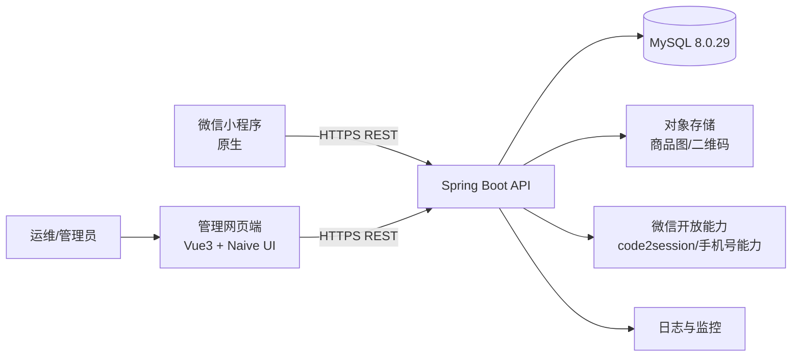

# 积分商城项目技术架构文档

- 文档版本：v1.0
- 编写日期：2026-03-16
- 关联文档：`项目需求文档.md`
- 目标读者：产品经理、前端开发、后端开发、测试、运维

---

## 1. 架构目标与设计原则

## 1.1 架构目标
1. 支撑积分商城核心闭环：登录 → 浏览 → 积分兑换 → 履约 → 查询追溯。
2. 同时支撑三端协作：**小程序端（原生）**、**管理网页端（Vue3 + Naive UI）**、**后端服务（Spring Boot）**。
3. 满足高一致性场景：积分扣减、库存扣减、订单生成必须原子化。
4. 便于后续扩展（活动规则、统计看板、消息通知、多实例部署）。

## 1.2 设计原则
- **业务优先**：优先满足 P0 需求和业务链路稳定性。
- **模块解耦**：按领域拆分模块，减少跨模块耦合。
- **一致性优先**：积分与库存场景使用事务 + 幂等机制。
- **安全合规**：用户隐私数据脱敏、权限分层控制、操作可审计。
- **可运维**：日志、监控、告警、备份具备落地方案。

---

## 2. 技术栈与版本基线

## 2.1 技术栈总览

| 层级 | 技术选型 | 版本/说明 |
|---|---|---|
| 小程序端 | 微信原生小程序 | 原生框架（WXML/WXSS/JS） |
| 管理网页端 | Vue 3 + Naive UI | Vue 3.x、Naive UI 2.x |
| 前端工程化 | Vite + TypeScript + Pinia + Vue Router + Axios | 管理端推荐组合 |
| 后端框架 | Spring Boot | 3.x（建议 JDK 17） |
| 持久层 | MyBatis-Plus / MyBatis | 与 Spring Boot 集成 |
| 数据库 | MySQL | **8.0.29** |
| 缓存（可选） | Redis | 建议用于热点缓存/分布式锁（V1 可先不引入） |
| 文件存储 | OSS/MinIO/本地对象存储 | 商品图、二维码图 |
| 反向代理 | Nginx | HTTPS、静态资源、反向代理 |

## 2.2 架构风格
- V1 采用：**模块化单体（Modular Monolith）+ 前后端分离 + REST API**。
- 原因：开发效率高、部署简单、满足当前业务规模；后续可按模块平滑拆分微服务。

---

## 3. 总体架构设计

## 3.1 逻辑架构图



## 3.2 运行边界
- 小程序端：仅用户功能（浏览、兑换、订单、背包、个人中心）。
- 管理网页端：运营后台（商品、订单、积分、用户、二维码、推荐位管理）。
- 后端服务：统一提供用户端/管理端 API、业务规则、数据访问。

## 3.3 网络与域名建议
- `api.xxx.com`：后端 API 网关域名。
- `admin.xxx.com`：管理端网页域名。
- 小程序请求域名需在微信后台配置白名单。

---

## 4. 前端技术架构

## 4.1 小程序端（原生）架构

### 4.1.1 目录建议

```text
mini-program/
  app.js
  app.json
  app.wxss
  pages/
    home/
    category/
    product-detail/
    exchange-confirm/
    backpack/
    order-list/
    order-detail/
    profile/
    address/
    point-ledger/
  components/
    product-card/
    empty-state/
    point-badge/
  utils/
    request.js
    auth.js
    format.js
  services/
    user.js
    product.js
    order.js
    point.js
```

### 4.1.2 小程序分层
- **Page/Component 层**：页面展示与交互。
- **Service 层**：按业务模块封装 API 调用。
- **Utils 层**：请求封装、鉴权处理、格式化、错误处理。

### 4.1.3 小程序关键技术点
1. 登录流程：`wx.login` + 后端换取业务 token。
2. 统一请求拦截：token 注入、401 处理、错误 toast。
3. 列表页统一分页协议（pageNo/pageSize/total/list）。
4. TabBar 页面缓存策略，减少重复请求。

## 4.2 管理网页端（Vue3 + Naive UI）架构

### 4.2.1 技术组合
- Vue 3 + TypeScript
- Naive UI（后台组件库）
- Vite（构建工具）
- Pinia（状态管理）
- Vue Router（路由与权限）
- Axios（HTTP 请求）

### 4.2.2 目录建议

```text
admin-web/
  src/
    main.ts
    router/
    store/
    layouts/
    views/
      dashboard/
      user/
      point/
      category/
      product/
      order/
      group/
      recommend/
      system/
    components/
    api/
    utils/
```

### 4.2.3 管理端核心能力
1. RBAC 动态菜单（按角色加载菜单与按钮权限）。
2. 列表页规范（查询区 + 表格 + 分页 + 批量操作）。
3. Naive UI 主题统一（品牌色、状态色、暗黑模式可选）。
4. 上传组件统一封装（商品图、二维码图上传）。

---

## 5. 后端技术架构（Spring Boot）

## 5.1 模块划分（推荐包结构）

```text
backend/
  src/main/java/com/points/mall/
    common/         # 通用响应、异常、工具、枚举、上下文
    config/         # 安全、跨域、拦截器、Jackson、MyBatis 配置
    auth/           # 登录、token、权限认证
    user/           # 用户信息、地址管理
    point/          # 积分账户、积分流水、积分调整
    category/       # 分类管理
    product/        # 商品管理、库存管理、推荐位
    order/          # 兑换下单、审核、发货、履约
    backpack/       # 背包资产
    group/          # 群聊二维码资源
    operationlog/   # 操作日志
    stats/          # 统计聚合（预留）
```

## 5.2 分层规范
- **Controller**：接口协议、参数校验。
- **Service**：核心业务规则、事务边界。
- **Repository/Mapper**：数据库访问。
- **Domain/Entity**：领域模型与持久化模型。

## 5.3 鉴权与权限体系

### 5.3.1 小程序用户态鉴权
1. 小程序 `code` 传后端。
2. 后端调用微信接口换取 `openid/unionid`。
3. 首次登录自动注册用户并初始化积分账户。
4. 后端签发用户 JWT（短期）+ 刷新机制（可选）。

### 5.3.2 管理端鉴权
- 账号密码登录（可扩展短信/二次验证）。
- JWT + RBAC（角色、菜单、按钮、接口权限）。
- 支持账号冻结与强制下线。

## 5.4 关键业务事务设计

### 5.4.1 兑换下单事务（核心）
在一个本地事务中完成：
1. 校验用户状态、商品状态、库存、积分、限购。
2. 扣减库存（悲观锁或乐观锁版本号）。
3. 扣减积分并写积分流水。
4. 创建订单/订单项。
5. 虚拟商品可同步生成背包资产。

### 5.4.2 幂等设计
- 小程序提交兑换时携带 `request_id`（客户端生成 UUID）。
- 服务端落幂等表或订单唯一键，避免重复扣积分。

### 5.4.3 订单状态流转约束
- 仅允许：待审核→待发货→已发货→已完成。
- 驳回/取消需要记录原因、操作人、操作时间。

---

## 6. 接口架构规范

## 6.1 API 分层路径
- 用户端 API：`/api/v1/app/**`
- 管理端 API：`/api/v1/admin/**`

## 6.2 响应结构（统一）

```json
{
  "code": 0,
  "message": "ok",
  "data": {}
}
```

- `code=0` 表示成功。
- 非 0 为业务错误码（如积分不足、库存不足、状态非法）。

## 6.3 分页协议

```json
{
  "pageNo": 1,
  "pageSize": 20,
  "total": 100,
  "list": []
}
```

## 6.4 错误码分层建议
- `A***`：鉴权/权限类。
- `B***`：业务规则类（积分、库存、状态）。
- `S***`：系统异常类。

---

## 7. 数据库架构（MySQL 8.0.29）

## 7.1 数据库设计原则
1. 字符集统一 `utf8mb4`，排序规则统一。
2. 主键使用 `bigint`（雪花ID或自增策略统一）。
3. 时间字段统一 `datetime`（UTC+8 规范化存储策略明确）。
4. 核心表支持软删字段 `is_deleted`（审计要求高的场景可保留）。

## 7.2 核心库表示意（与 PRD 对齐）
- 用户域：`user`, `user_address`
- 积分域：`point_account`, `point_ledger`
- 商品域：`category`, `product`, `recommend_slot`
- 订单域：`exchange_order`, `exchange_order_item`, `order_logistics`
- 资产域：`backpack_asset`, `group_asset`
- 权限域：`admin_user`, `admin_role`, `admin_permission`, `admin_role_permission`
- 审计域：`operation_log`

## 7.3 索引策略
- 高频查询字段建普通索引：`user_id`、`order_no`、`product_id`、`status`、`created_at`。
- 唯一约束：`order_no`、`request_id`、`admin_username`。
- 积分流水按 `user_id + created_at` 复合索引。

## 7.4 事务与隔离级别
- 默认使用 MySQL `REPEATABLE READ`。
- 核心写操作（下单）使用事务。
- 并发库存更新建议 SQL：
  `update product set stock = stock - 1 where id = ? and stock > 0`

## 7.5 数据演进
- 使用 Flyway/Liquibase 管理 DDL 版本。
- 每次发布绑定数据库脚本版本，支持回滚策略。

---

## 8. 安全架构

## 8.1 认证与授权
- 用户态与管理态 token 严格隔离。
- 管理端接口按角色和权限点校验。
- 接口签名与时间戳校验（可选增强）。

## 8.2 数据安全
- 手机号前端默认脱敏展示。
- 管理端导出数据按权限控制。
- 敏感配置放入环境变量/配置中心，不入库明文。

## 8.3 攻击防护
- 登录与下单接口限流（IP + 用户维度）。
- 防重复提交、SQL 注入（参数化）、XSS 过滤。
- 文件上传校验（MIME/大小/后缀白名单）。

---

## 9. 性能与可用性设计

## 9.1 性能目标对应策略
- 首页/分类接口 ≤ 1.5s：
  - 必要字段返回、分页、索引优化。
  - 热点数据（分类、推荐位）可缓存（本地缓存或 Redis）。

## 9.2 稳定性策略
- 统一异常处理 + 统一错误码。
- 关键链路超时控制（数据库、微信接口、对象存储）。
- 外部接口失败降级（如微信接口重试与兜底提示）。

## 9.3 可扩展性策略
- 按业务模块拆包，避免“大 Service”。
- 统计能力与核心交易解耦（可后续异步化）。
- 接口版本化（`/api/v1`）为未来兼容保留空间。

---

## 10. 部署与运维架构

## 10.1 环境规划
- `dev`：开发联调环境。
- `test`：测试/UAT 环境。
- `prod`：生产环境。

## 10.2 部署拓扑（V1）
1. Nginx：TLS 终止 + 静态资源 + API 反向代理。
2. Spring Boot：单实例起步（可横向扩展多实例）。
3. MySQL 8.0.29：主从或单主（按预算与 SLA）。
4. 对象存储：存放图片/二维码。

## 10.3 CI/CD 建议
- Git 分支策略：`main` / `develop` / `feature/*`。
- 自动流程：构建 → 单测 → 制品 → 部署 → 冒烟测试。
- 发布策略：灰度发布（可选）+ 回滚预案。

## 10.4 备份恢复
- MySQL 每日全量 + Binlog 增量备份。
- 备份保留周期与恢复演练（月度）。
- 对象存储跨区域或多副本策略（按成本选型）。

---

## 11. 日志、监控与审计

## 11.1 日志规范
- 统一 JSON 日志格式（推荐）。
- 链路字段：`traceId`、`userId`、`requestId`、`uri`、`latency`。
- 业务关键日志：兑换请求、积分变更、订单状态变更。

## 11.2 监控指标
- 应用指标：QPS、RT、错误率、JVM、线程池。
- 数据库指标：慢 SQL、连接数、锁等待。
- 业务指标：兑换成功率、驳回率、发货时长。

## 11.3 审计要求
- 后台敏感操作必须入 `operation_log`。
- 日志包含操作人、前后值、时间、IP、模块。

---

## 12. 关键技术方案（与需求强绑定）

## 12.1 积分与订单一致性方案
- 本地事务覆盖扣积分 + 写流水 + 生成订单。
- 审核驳回时，按反向流水补偿积分。
- 所有积分变更必须有来源单号（订单号/操作单号）。

## 12.2 库存防超卖方案
- 下单 SQL 原子扣减 + 行级锁。
- 失败立即返回库存不足。
- 高并发场景可升级 Redis 分布式锁（V2）。

## 12.3 群二维码商品发放方案
- 群商品作为商品类型之一（`product_type = GROUP_QR`）。
- 兑换成功后生成背包资产，返回可查看二维码入口。

---

## 13. 风险与应对

| 风险 | 描述 | 应对策略 |
|---|---|---|
| 并发超卖 | 热门商品瞬时兑换高并发 | 原子扣减 SQL + 事务 + 限流 |
| 重复扣积分 | 用户重复点击提交 | request_id 幂等 + 唯一索引 |
| 外部接口不稳定 | 微信接口偶发失败 | 超时重试 + 兜底提示 + 监控告警 |
| 人工误操作 | 后台误改积分/订单 | 权限控制 + 操作日志 + 二次确认 |
| 慢查询 | 订单/流水数据增长 | 索引优化 + 分页 + 归档策略 |

---

## 14. 与后续文档的接口定义

## 14.1 对 MySQL 设计文档输入
- 核心实体、关系、索引策略、事务边界已明确。
- 下一步输出：详细表结构（字段、类型、索引、约束、DDL）。

## 14.2 对开发计划文档输入
- 模块边界已明确（前端/后端/后台）。
- 可按“登录、商品、兑换、订单、积分、背包、后台管理”拆迭代。
- 可按 P0/P1 制定里程碑和测试范围。

---

## 15. 本文档结论

本架构方案在既定技术栈下（**原生小程序 + Vue3/Naive UI + Spring Boot + MySQL 8.0.29**）可完整覆盖当前 PRD 需求，重点保障积分兑换链路一致性与后台运营可管理性，并为后续数据库详细设计与开发排期提供可执行的技术基础。

